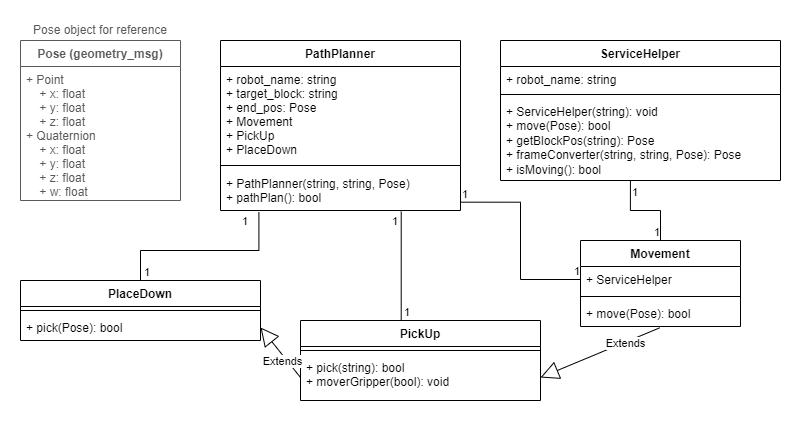

# ACS330 Multi-Robot Collaboration - Group 1

Efficient coordination of a multi-robot team is the key challenge in robotic application domains such as manufacturing, construction and service robotics. In cooperative manipulation tasks, the system dynamics result from the complex interaction of several manipulators handling a common object. However, the widespread use of robots in flexible factories  is limited by the robots’ inability to safely collaborate with one another. The robots’ incapacity to coordinate, communicate, and understand their actions, roles, and task statuses thus decreases the robots’ usefulness in applications where tasks cannot be completed by a single robot. This limitation is driven by both the absence of tools and protocols needed for describing collaborative functions.

This project shall look at the creation of a sophisticated model-based control algorithm for the effective and efficient interaction of multiple robots into their production processes.

# ROS Information

Robot Namespaces - `robot_ns = ["mover6_a", "mover6_b]`

Robot Joints - `1 -> 6`

**Node Graph Diagram**


**Path Planner Class Diagram**



## Core nodes

| Nickname | Package | Description | Startup Script |
| - | - | - | - |
| `./run_sim.sh` |  |  |  |
| ROS Core | roscore | ROS Core required for ROS to Function | `roscore` |
| Gazebo Simulation | mover6_gazebo | Launches Gazebo and spawns a mover6 robot | `./run_sim.sh` |
| Sim Robot Joint Controller | mover6_control | Starts the listener node for Sim Robot Joint Positions | `./run_sim_control.sh` |
| Block Spawner | block_controller | Randomly generate a large number of blocks at random rotations in the workspace | `rosrun block_controller spawn_blocks.py` |
| `./run_demo.sh` |  |  |  |
| Block Position Publisher | block_pos_talker | Gathers block positions from gazebo and publishes them in `Blocks` message format to `/blocks_pos` | `rosrun block_controller block_pos_talker.py` |
| Inverse kinematics | inv_kinematics | Runs service `inverse-kinematics` and publish inverse kinematics to relevant joint position controller | `rosrun inv_kinematics inv_kin_srv.py` |
| Joint Controller | joint_controller | Controls whether or not simulation and physical robots recieve commands as required. Runs once per robot. Needs lauch file. | `rosrun joint_controller joint_controller.py` |
| Gripper Controller | joint_controller | Controlls the Gripper based on the selection channel. Runs once per robot. Needs lauch file. | `rosrun joint_controller gripper_controller.py` |
| Nearest Block Assignment Selection | assignment_selection | Finds which robot is closest to each robot and publishes to `robot_namespace/next_block` with 2 second cadence. | `rosrun assignment_selection block_selection.py` |
| Path Planner | path_planning | Mega node using OOP to plan and execute pick and place operations. | `rosrun path_planning path_plan.py` |
| Block Fiducial Detector | fiducial_recognition | Runs camera setup, image processing, apriltag detection and cartesian block coordinates relative to mover6a | `roslaunch fiducial_recognition fiducial_recognition.launch camera_name:=/usb_cam image_topic:=image_rect_color` |
| `./connect_robo_setup.sh` |  | Runs the comands to connect the robot arms to the computer. Needs to be run once each time the computer boots. |   |
| `./connect_mover6a.sh` `./connect_mover6b.sh` | | | Use launch files so that they are namespaced correctly. |
| CPR robot controller | cpr_robot | Modifed version of the controller provided in the CPR_Robot git page. The modifications allow for they system to be namespaced. | |
| Mover6 driver | joint_controller| Takes the output form the joint controller and passes it to rvis and the CPR_Robot package. | |

## Additional nodes

| Nickname | Package | Description | Startup Script |
| - | - | - | - |
| Joint Position Movement Demo | movement_demo | Moves the mover6 joint's through the full range of motion via joint position | `rosrun mover6_joint_movement_demo joint_movement_demo.py`|
| Kinematics Movement Demo | movement_demo | Moves both mover6 robots to 5cm above randomly selected block, alternating robots on 2 second cadence. | `rosrun mover6_joint_movement_demo kinematics_movement_demo.py` |
| Test Kinematic Chain | movement_demo | Executes Path Plan service call once | `rosrun mover6_joint_movement_demo test_kinematic_chain.py` |
| Mover6 Driver | joint_controller | Relays data from physical robot demand position to physical robot including change of units. |`export ROS_NAMESPACE=/mover6_a_p` `rosrun joint_controller mover6_driver` |
| Fixed Zone Controller | zone_controller | Publishes a pair of fixed zones for testing purposes. | `rosrun zone_controller fixed_zone.py` |
| Zone Point Detection Demo (Including TF Forward Kinematics demo) | zone_detection | Checks whether a point is in each published zone. Also demonstrate forward kinematics using Transform Trees. | `rosrun zone_detection point_detect.py` |

## Topics

| Nickname | Name | Data Format | Python Data Format Import | Publishers | Subscribers |
| - | - | - | - | - | - |
| Roscore | `/rosout` `/rosout_agg` | Roscore setup nodes |  |  |  |
| Block Positions | `/blocks_pos` | `block_controller Blocks OR tf2_listener` | `from block_controller.msg import Block, Blocks` | `block_controller block_pos_talker.py OR tf2_listener.py` | `assignment_selection block_selection.py` |
| Gazebo Model States (All Models) | `/gazebo/model_states` | `gazebo_msgs ModelStates` | `from gazebo_msgs.msg import ModelStates` | Gazebo | `block_controller block_pos_talker.py` | 
| Next block to pick | `robot_ns/next_block` | `std_msgs Strings` | `from std_msgs.msg import String` | `assignment_selection block_selection.py` | `movement_demo basic_kinematic_movement.py` |
| Gazebo Joint Position Controller | `robot_ns/jointX_position_controller/command` | `from std_msgs.msg import Float64` | `inv_kinematics inv_kin_srv.py`, `movement_demo joint_movement_demo.py`, `inv_kin_ros.m` | Gazebo |
| Setup/RVis | `/clicked_point`, `/initialpose`, `/move_base_simple/goal` | Setup and run by rvis/CPR_Robot driver | We do not use however are needed for setup |  |  |
| Mover6 Input Channel | `/robot_ns_p/InputChannels` | cpr_robot/ChannelStates |  | /mover6_a_p/CPRMover6 | /mover6_a_p/rviz |
| Mover6 Output Channel | `/robot_ns_p/OutputChannels` | cpr_robot/ChannelStates |  | /mover6_a_p/CPRMover6 | /mover6_a_p/rviz |
| Mover6 Move Commands | `/robot_ns_p/JointJog` | control_msgs/JointJog |  | /mover6_a_p/mover6_driver /mover6_a_p/rviz | /mover6_a_p/CPRMover6 |
| Current Joint Angles | `/robot_ns_p/joint_states` | sensor_msgs/JointState |  | /mover6_a_p/CPRMover6 | /mover6_a_p/robot_state_publisher /mover6_a_p/mover6_driver /mover6_a_p/rviz |
| Desired Joint Angles | `/robot_ns_p/physical/joint_angles` | custom_msgs/Joints |  | /mover6_a_p/mover6_driver |  |
| Current Moving State | `/robot_ns_p/physical/moving_state` | std_msgs/String |  | /mover6_a_p/mover6_driver |  |
| CPR Robot State | `/robot_ns_p/robot_state` | cpr_robot/RobotState |  | /mover6_a_p/CPRMover6 | /mover6_a_p/rviz |
| Mover6 gripper Controller | /robot_ns_p/gripper_state | std_msgs/Bool | `from std_msgs.msg import Bool` |  | /mover6_a_p/gripper_controller |

## Services

| Nickname | Name | Location | Python Import | Input Format | Response Format |
| - | - | - | - | - | - |
| Specific Model Position | `gazebo/get_model_state'` | Gazebo | `from gazebo_msgs.srv import GetModelState` | `string model_name`, `string relative_entity_name` | `gazebo_msgs ModelState` |
| Specific Link Position | `gazebo/get_link_state'` | Gazebo | `from gazebo_msgs.srv import GetLinkState` | `string model_name`, `string relative_entity_name` | `gazebo_msgs LinkState` |
| URDF Spawner | `gazebo/spawn_urdf_model` | Gazebo | `from gazebo_msgs.srv import SpawnModel` | `gazebo_msgs SpawnModel` | `bool success`, `string status_message` |
| ikpy Inverse Kinematics | `inverse_kinematics` | `inv_kinematics inv_kin_srv.py` | `from inv_kinematics.srv import InvKin` | `gazebo_msgs ModelState` | `bool success` |
| Path Planner | `path_planner` | `path_planning path_plan.py` | `from path_planning.srv import PathPlan` | `string robot-name`, `geometry_msg/Pose end_pos`, `string block_name` | `bool success` |

# How to Build and Run

## ROS/Gazebo simulation build

1. Navigate to `~/catkin_ws` in Ubuntu Terminal.

2. Build the project by running `catkin_make`. Only the `src` and build scripts are stored in the GH Repo so this will build the `build` and `devel` folders.

3. Each set of nodes is started separately, in its own Terminal tab to allow easier testing of individual nodes. This is **made much easier by using the Tabs feature** in your Terminal program. Each group of nodes has its own `.sh` script to start the node and can be stopped with `Ctrl+C`.

## Startup Instructions

Run each of the following in its own terminal tab, after running `cd ~/catkin_ws`.

 - `roscore` - ROS Core
 - `./run_sim.sh` - Gazebo Simulation, Sim Robot Joint Controller, Block Spawner
 - `./run_demo.sh` - Block Position Publisher, Inverse Kinematics, Kinematic Movement, Near Block Assignment Selection

### Mover6 Dashboard with RViz

```
catkin_make clean
catkin_make rebuild_cache
catkin_make
catkin_make install
roslaunch cpr_robot CPRMover6.launch
```

# Connecting and setting up Networking

## Connecting Linux machine to robotwlan

```
nmcli c show
nmcli c down eduroam
nmcli c up robotwlan
```

You will need to conect your device to the `robotwlan` network, accessable in certain areas of the university or the wired university network.

## Setup localhost after network

```
$ export ROS_HOSTNAME=localhost
$ export ROS_MASTER_URI=http://localhost:11311
```

## Roscore Host Mechine

Run to setup roscore on network.

```
$ hostname -I
0.0.0.1         #Example ip
$ export ROS_HOSTNAME=0.0.0.1
$ export ROS_MASTER_URI=http://0.0.0.1:11311/
$ roscore
...
ROS_MASTER_URI=http://0.0.0.1:11311/       #Makesure you see this line in roscore output
...
```

Run in every tab opened afterwards.

```
$ export ROS_HOSTNAME=0.0.0.1
$ export ROS_MASTER_URI=http://0.0.0.1:11311/
```

## Worker Mechine

```
$ hostname -I
0.0.0.2         #Example ip
$ export ROS_HOSTNAME=0.0.0.2
$ export ROS_MASTER_URI=http://0.0.0.1:11311/
```

Run in every tab you open.

```
$ export ROS_HOSTNAME=0.0.0.2
$ export ROS_MASTER_URI=http://0.0.0.1:11311/
```

# Run on Windows through Windows Subsystems for Linux

The project can be run on Windows using WSL2 based on [this guide from DR Tom Howard TuoS](https://github.com/tom-howard/COM2009/wiki/Working-On-Your-Own-Computer#installing-on-windows-using-wsl)

## Ubuntu (Linux) Install

Windows 11 works best but can using Windows 10 with more effort.

Install Windows Subsystems for Linux 2 using Ubuntu 20.04 Distribution with: `wsl --install -d Ubuntu-20.04` in Terminal. Use Windows Terminal, not command prompt! You may need to install Windows Terminal [here](https://apps.microsoft.com/store/detail/windows-terminal/9N0DX20HK701?hl=en-gb&gl=gb).


Set a short username i.e. your first name and a password you can remember and type quickly - it doesn't need to be massively secure!

Reboot computer.

Type `wsl --status` and make sure it returns:
```bash
Default Distribution: Ubuntu-20.04
Default Version: 2
```

Now we're gonna get to the Ubuntu command line and install ROS. 

Go to Terminal and click the down arrow in the top tab bar, then click `Ubuntu 20.04`. You should have a new terminal tab which says `Username@PC_Name`, this is the Ubuntu terminal.

## ROS Install

Now, install ROS by running each of the following commands:
```bash
sudo sh -c 'echo "deb http://packages.ros.org/ros/ubuntu $(lsb_release -sc) main" > /etc/apt/sources.list.d/ros-latest.list'
curl -s https://raw.githubusercontent.com/ros/rosdistro/master/ros.asc | sudo apt-key add -
sudo apt update
sudo apt install ros-noetic-desktop-full
```

Next, setup terminal to run ROS commands properly as outlined below. `pico` opens a Command Line text editor which will allow you to edit the `.bashrc` files and add the relevant lines. The pico editor is navigated with the arrow keys and you can type as normal. To save press `Ctrl+X` then `Enter`.
```bash
cd
pico .bashrc # Or open this text file in a text editor
# Add following to the end of the file
source /opt/ros/noetic/setup.bash
source ~/catkin_ws/devel/setup.bash
```

Close the terminal and reopen it.

## Dependencies Install

```bash
sudo apt-get update
sudo apt-get install ros-noetic-ros-control ros-noetic-ros-controllers ros-noetic-apriltag ros-noetic-apriltag-ros ros-noetic-image-pipeline ros-noetic-usb-cam ros-noetic-trac-ik python3-pil.imagetk
sudo apt install python3-pip
pip install ikpy
pip install numpy --upgrade
```

## Clone repository

```bash
mkdir ~/catkin_ws
cd ~/catkin_ws
git clone https://github.com/ACS330-Collaborative-Robotics/Multi-Robot-Collaboration.git .
```

## Open in Editor

Use VSCode which can be downloaded [here](https://code.visualstudio.com/download).

To open run `code .` in Ubuntu terminal in `~/catkin_ws`

## Setup GitHub credentials

Log into GitHub through VSCode then setup username and email using:

```bash
git config --global user.name "USERNAME"
git config --global user.email "EMAIL"
```

## Reccomended VS Code Extension

There are a few VSCode exentension that will make your life much easier so I would reccomend installing the ones listed below using the Extensions tab on the right.
 - WSL - This extension makes VSCode play nicely with the WSL system. This will make the terminal in VSCode into an Ubuntu terminal too which makes running commands much easier.
 - GitLens - Makes VSCode and GitHub play nicely together.
 - C/C++
 - Python
 - Pylance
 - Todo Tree
 - A nice theme - I reccomend One Dark Pro ;)

## Run Software

See *How to Build* above.

# Useful Links

- [CPR Robots Driver Repo](https://github.com/CPR-Robots/cpr_robot)
- [ROS Wiki](http://wiki.ros.org/Documentation)
- CPR Robots Docs - /src/cpr-robot/doc/html/index.html
- [UR5 ROS Gazebo](https://github.com/lihuang3/ur5_ROS-Gazebo)
- [Gazebo Message Docs](http://docs.ros.org/en/noetic/api/gazebo_msgs/html/index-msg.html)

## Gazebo Tutorials

- [ROS integration overview](https://classic.gazebosim.org/tutorials?tut=ros_overview) 
- [Using roslaunch](https://classic.gazebosim.org/tutorials?tut=ros_roslaunch&cat=connect_ros)
- [URDF in Gazebo](https://classic.gazebosim.org/tutorials?tut=ros_urdf&cat=connect_ros)
- [ROS plugin](https://classic.gazebosim.org/tutorials?tut=ros_plugins&cat=connect_ros)
- [Convert xacro to URDF](https://www.oreilly.com/library/view/mastering-ros-for/9781788478953/d04a8d45-b84b-4c3e-ad03-eb158fe5f451.xhtml)
- [ROS Control](https://classic.gazebosim.org/tutorials?tut=ros_control)
- [Creating and Spawning Custom URDF Objects in Simulation](http://wiki.ros.org/simulator_gazebo/Tutorials/SpawningObjectInSimulation)
- [Manipulate and interact with simulation and simulated objects](http://wiki.ros.org/simulator_gazebo/Tutorials/Gazebo_ROS_API)

# Fixes

**Gazebo not launching properly**

`htop` and kill `gzserver` 

**Setup not done properly**

```bash
cd
pico .bashrc # Or open this text file in a text editor
# Add following to the end of the file
source /opt/ros/noetic/setup.bash
source ~/catkin_ws/devel/setup.bash
```

**CPR robot not conetting/working after running ./reconnect_robo.sh**
Probably dont have ifconfig
```
apt install net-tools
```

**Failed to launch joint_position_controller**

Need to install ros-control and ros-controllers using: `sudo apt-get install ros-noetic-ros-control ros-noetic-ros-controllers`

**ROS Ignoring the first message on a topic**

ROS needs to know where each node is subscribed to and publishing to. This needs to happen before you can publish your first message. It then needs an amount of time to process this otherwise it will ignore the first message. e.g.

```python
## Incorrect method ##
pub = rospy.Publisher("/topic_name", Joints, queue_size=10)
pub.publish(joints)

## More correct method ##
pub = rospy.Publisher("/topic_name", Joints, queue_size=10)
# Delay or run calculations
pub.publish(joints)
```

**Gazebo Black Screen on Launch in WSL**

First, try install/update your graphics card drivers following [these instructions](https://learn.microsoft.com/en-us/windows/wsl/tutorials/gui-apps#prerequisites).

If this doesnt fix the issues, or you have an Intel Xe Graphics card, you will need disable GPU acceleration, rendering only on your CPU. This will be very slow but better than nothing. Add `export  LIBGL_ALWAYS_SOFTWARE=1` to the end of your `.bashrc` file. Restart your terminal and it should work.

**apriltag_ros missing a camera calibration file**

In the Google Drive in the 'Techincal Documentation' folder there is a 'camera calibration' folder containing a calibration file. 'head_camera.yaml' must be placed in a folder called 'camera_info' in 'home/.ros'

**roslaunch not finding packages that exist**
run - 'source /home/uos/catkin_ws/devel/setup.bash' (or other path)
